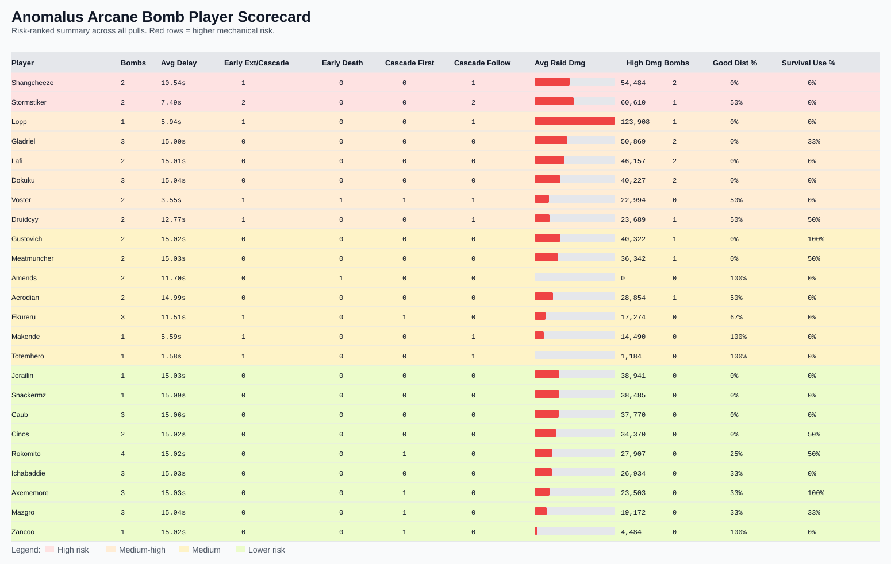
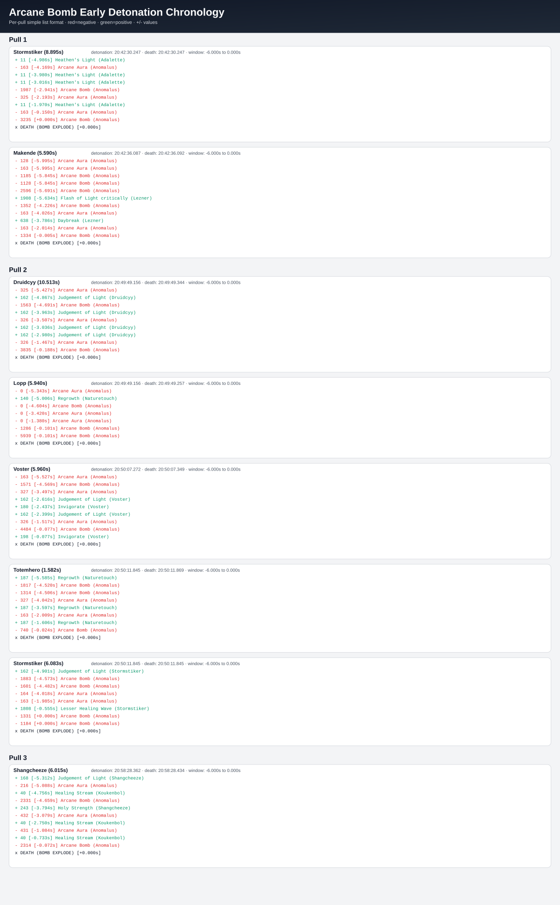

# Anomalus Comprehensive Fight Report

This report consolidates all findings across Arcane Aura performance, Arcane Bomb mechanic failures, and healer output.

## Included Scorecard Graphic

---

## 1) Pull Outcomes

- Pull 1: **Wipe** (108.37s)
- Pull 2: **Wipe** (111.54s)
- Pull 3: **Kill** (122.72s)

---

## 2) Arcane Aura (Raid-Wide Pulse) Metrics

| Pull | Pulses | Total Hits | Avg Hit | Highest Avg Taken | Lowest Avg Taken |
|---|---:|---:|---:|---|---|
| 1 | 70 | 2290 | 217.9 | Lochien (347.5) | Ichabaddie (105.0) |
| 2 | 73 | 2468 | 217.4 | Shangcheeze (362.9) | Aerodian (92.4) |
| 3 (Kill) | 61 | 2457 | 211.4 | Lopp (337.5) | Jorailin (104.7) |

### Arcane Aura Notes

- Pull 3 had the best average aura mitigation.
- Several players consistently ran high aura intake (likely lower resistance/absorb coverage).
- Low aura averages were stable across pulls for a core set of players.

---

## 3) Arcane Bomb - Tight Causality Findings

Bombs were traced per player from `Arcane Overload -> Arcane Bomb` to classify whether early detonations were:

1. external/cascade-caused (player not primary root cause),
2. external spike-caused (e.g., Unstable Magic),
3. death-triggered in pre-window,
4. full-timer detonations with poor distance.

### Arcane Bomb Early-Det Death Timeline Chart

This second Arcane Bomb chart now uses a simple chronological bullet-style structure per pull for carriers whose bombs detonated early and where the carrier died at/near detonation.

- Window shown per case: **6 seconds before death** (listed in order)
- **Red** lines = damage taken (with spell name)
- **Green** lines = healing received (with spell name)
- Excludes events within **2.0s of pull end**

Text version (same structure): [`anomalus_bomb_early_det_timeline.md`](./anomalus_bomb_early_det_timeline.md)

### Global Bomb Timing Summary

- Bombs with valid Overload pairing: **51**
- Early bombs (<12s): **11**
  - Early due to cascade from other bomb: **8**
  - Early due to Unstable Magic external spike: **1**
  - Early with death-trigger pattern: **2**

Interpretation: most early detonations were **cascade-driven**, not standalone carrier mistakes.

---

## 4) Double/Triple Detonation Sequences (Specifics)

### Pull 1

1. **Double:** Ekureru -> Stormstiker  
   - First det: Ekureru at 4.407s (early)  
   - First-cause: **Unstable Magic spike** (11,260 in pre-window)  
   - Follow-up: Stormstiker at 8.895s (cascade)  
   - Cluster raid damage: **115,992**

2. **Double:** Voster -> Makende  
   - First det: Voster at 1.137s (very early)  
   - First-cause: **death-trigger pattern** (non-bomb pressure immediately before det)  
   - Follow-up: Makende at 5.590s (cascade)  
   - Cluster raid damage: **30,069**

### Pull 2

1. **Triple:** Axememore -> Druidcyy -> Lopp  
   - First det: Axememore at 15.023s (**full timer**)  
   - Follow-ups: Druidcyy at 10.513s, Lopp at 5.940s (both cascade)  
   - Cluster raid damage: **149,577** (largest event)

2. **Double:** Zancoo -> Voster  
   - First det: Zancoo at 15.020s (**full timer**)  
   - Follow-up: Voster at 5.960s (cascade)  
   - Cluster raid damage: **34,894**

3. **Triple:** Rokomito -> Totemhero -> Stormstiker  
   - First det: Rokomito at 15.029s (**full timer**)  
   - Follow-ups: Totemhero at 1.582s, Stormstiker at 6.083s (cascade)  
   - Cluster raid damage: **14,150**

### Pull 3 (Kill Pull)

1. **Double:** Mazgro -> Shangcheeze  
   - First det: Mazgro at 15.048s (**full timer**)  
   - Follow-up: Shangcheeze at 6.015s (cascade)  
   - Cluster raid damage: **71,945**

Key pattern: several of the worst cascades began with **on-time** bombs, then follow-up carriers detonated early from prior bomb splash while escaping.

---

## 5) Lowest vs Highest Bomb Raid-Damage Events

### Lowest Raid-Damage Bomb Events

- Pull 1: Amends -> **0**
- Pull 2: Amends -> **0**
- Pull 3: Aerodian -> **17,663** (lowest non-zero on kill pull)

### Highest Raid-Damage Bomb Events (Clusters)

1. Pull 2 triple (Axememore + Druidcyy + Lopp): **149,577**
2. Pull 1 double (Ekureru + Stormstiker): **115,992**
3. Pull 3 double (Mazgro + Shangcheeze): **71,945**

### Highest Single-Caster Bomb Damage

1. Gladriel (Pull 2): **70,846**
2. Meatmuncher (Pull 3): **48,198**
3. Lafi (Pull 2): **47,081**

Most high-damage bombs were **full-timer detonations with insufficient distance** rather than only short timers.

### Arcane Pulse Trigger Attribution Update

- Arcane Pulse-related attribution now prioritizes **Arcane Aura-linked early Arcane Bomb triggers** over generic Arcane Aura death counts.
- Arcane Pulse death/trigger attribution excludes events within **2.0 seconds of pull end** to avoid wipe-call/end noise.

---

---

## 6) Healer Performance Summary

### Per-pull top throughput (high-level)

- Pull 1 leaders: Naturetouch, Lezner, Sarys, Dokuku, Amends
- Pull 2 leaders: Dokuku, Naturetouch, Amends, Lezner, Gladriel
- Pull 3 leaders: Dokuku, Sarys, Gladriel, Nawern, Koukenbol

### Overheal Proxy (pull-level)

Computed as `(total healing done to players - total incoming damage to players) / total healing`.

- Pull 1: **0.28%**
- Pull 2: **2.88%**
- Pull 3: **12.79%**

Note: raw log format does not expose direct per-cast overheal fields, so this is a pull-level proxy.

---

## 7) Arcane Bomb Per-Player Scorecard (Detailed Table)

Columns:
- `early_ext_or_cascade`: early bombs due to external mechanics or bomb cascade
- `early_self_death`: early bombs with death-trigger pattern
- `good_distance_rate`: bombs with excellent/good raid-damage profile
- `survival_usage_rate`: pre-detonation consumable/survival usage signal

| player | bombs | avg_delay | early_ext_or_cascade | early_self_death | cascade_first | cascade_followup | avg_raid_dmg | high_raid_dmg_bombs | good_distance_rate | survival_usage_rate |
|---|---:|---:|---:|---:|---:|---:|---:|---:|---:|---:|
| Shangcheeze | 2 | 10.54 | 1 | 0 | 0 | 1 | 54484 | 2 | 0% | 0% |
| Gladriel | 3 | 15.00 | 0 | 0 | 0 | 0 | 50869 | 2 | 0% | 33% |
| Lafi | 2 | 15.01 | 0 | 0 | 0 | 0 | 46157 | 2 | 0% | 0% |
| Dokuku | 3 | 15.04 | 0 | 0 | 0 | 0 | 40227 | 2 | 0% | 0% |
| Stormstiker | 2 | 7.49 | 2 | 0 | 0 | 2 | 60610 | 1 | 50% | 0% |
| Lopp | 1 | 5.94 | 1 | 0 | 0 | 1 | 123908 | 1 | 0% | 0% |
| Druidcyy | 2 | 12.77 | 1 | 0 | 0 | 1 | 23689 | 1 | 50% | 50% |
| Gustovich | 2 | 15.02 | 0 | 0 | 0 | 0 | 40322 | 1 | 0% | 100% |
| Meatmuncher | 2 | 15.03 | 0 | 0 | 0 | 0 | 36342 | 1 | 0% | 50% |
| Aerodian | 2 | 14.99 | 0 | 0 | 0 | 0 | 28854 | 1 | 50% | 0% |
| Voster | 2 | 3.55 | 1 | 1 | 1 | 1 | 22994 | 0 | 50% | 0% |
| Ekureru | 3 | 11.51 | 1 | 0 | 1 | 0 | 17274 | 0 | 67% | 0% |
| Makende | 1 | 5.59 | 1 | 0 | 0 | 1 | 14490 | 0 | 100% | 0% |
| Totemhero | 1 | 1.58 | 1 | 0 | 0 | 1 | 1184 | 0 | 100% | 0% |
| Amends | 2 | 11.70 | 0 | 1 | 0 | 0 | 0 | 0 | 100% | 0% |
| Jorailin | 1 | 15.03 | 0 | 0 | 0 | 0 | 38941 | 0 | 0% | 0% |
| Snackermz | 1 | 15.09 | 0 | 0 | 0 | 0 | 38485 | 0 | 0% | 0% |
| Caub | 3 | 15.06 | 0 | 0 | 0 | 0 | 37770 | 0 | 0% | 0% |
| Cinos | 2 | 15.02 | 0 | 0 | 0 | 0 | 34370 | 0 | 0% | 50% |
| Rokomito | 4 | 15.02 | 0 | 0 | 1 | 0 | 27907 | 0 | 25% | 50% |
| Ichabaddie | 3 | 15.03 | 0 | 0 | 0 | 0 | 26934 | 0 | 33% | 0% |
| Axememore | 3 | 15.03 | 0 | 0 | 1 | 0 | 23503 | 0 | 33% | 100% |
| Mazgro | 3 | 15.04 | 0 | 0 | 1 | 0 | 19172 | 0 | 33% | 33% |
| Zancoo | 1 | 15.02 | 0 | 0 | 1 | 0 | 4484 | 0 | 100% | 0% |

