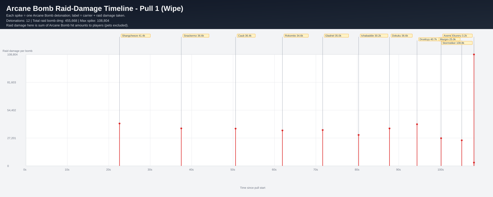
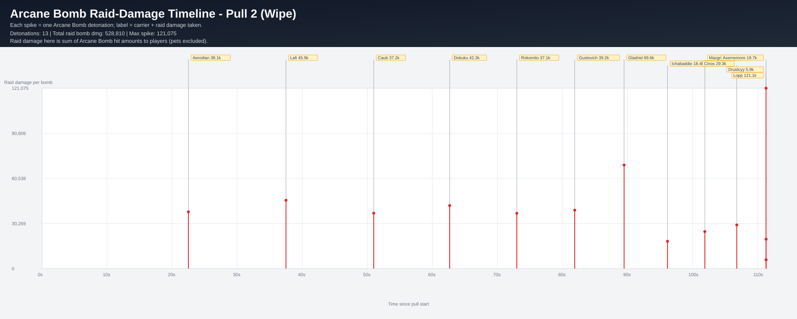
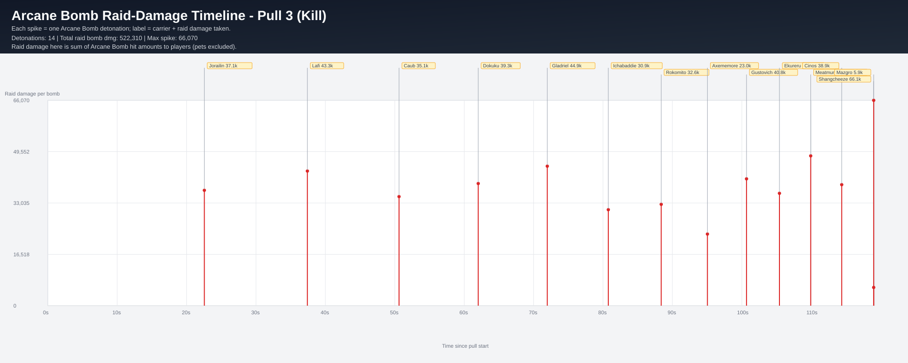

# Arcane Bomb Raid-Damage Spike Timelines (Per Pull)

Each spike is one `Arcane Bomb` detonation. Spike height/value is total **raid damage taken** from that detonation (sum of player hit values).

- Labels show: **carrier name + raid damage**
- Times are relative to pull start (`Arcane Aura` cast marker)

## Pull 1 (Wipe)

- Detonations: **12**
- Total raid bomb damage (taken): **455,668**
- Max single spike: **108,804**
- Fight duration shown: **108.37s**

| t_rel | carrier | raid_damage_taken | player_hits |
|---:|---|---:|---:|
| 22.589s | Shangcheeze | 41,401 | 38 |
| 37.493s | Snackermz | 36,630 | 38 |
| 50.608s | Caub | 36,419 | 37 |
| 61.912s | Rokomito | 34,606 | 34 |
| 71.634s | Gladriel | 35,015 | 36 |
| 80.310s | Ichabaddie | 30,240 | 36 |
| 87.766s | Dokuku | 36,598 | 36 |
| 94.408s | Druidcyy | 40,685 | 35 |
| 100.220s | Axememore | 27,044 | 33 |
| 105.211s | Mazgro | 24,991 | 33 |
| 108.152s | Ekureru | 3,235 | 1 |
| 108.152s | Stormstiker | 108,804 | 65 |

## Pull 2 (Wipe)

- Detonations: **13**
- Total raid bomb damage (taken): **528,810**
- Max single spike: **121,075**
- Fight duration shown: **111.54s**

| t_rel | carrier | raid_damage_taken | player_hits |
|---:|---|---:|---:|
| 22.512s | Aerodian | 38,125 | 39 |
| 37.507s | Lafi | 45,883 | 38 |
| 51.002s | Caub | 37,214 | 39 |
| 62.669s | Dokuku | 42,306 | 39 |
| 72.991s | Rokomito | 37,131 | 36 |
| 81.889s | Gustovich | 39,245 | 37 |
| 89.477s | Gladriel | 69,551 | 39 |
| 96.153s | Ichabaddie | 18,392 | 36 |
| 101.887s | Mazgro | 24,874 | 31 |
| 106.793s | Cinos | 29,345 | 36 |
| 111.297s | Axememore | 19,730 | 17 |
| 111.297s | Druidcyy | 5,939 | 1 |
| 111.297s | Lopp | 121,075 | 79 |

## Pull 3 (Kill)

- Detonations: **14**
- Total raid bomb damage (taken): **522,310**
- Max single spike: **66,070**
- Fight duration shown: **119.12s**

| t_rel | carrier | raid_damage_taken | player_hits |
|---:|---|---:|---:|
| 22.556s | Jorailin | 37,121 | 39 |
| 37.407s | Lafi | 43,318 | 38 |
| 50.608s | Caub | 35,093 | 38 |
| 62.019s | Dokuku | 39,310 | 39 |
| 71.970s | Gladriel | 44,884 | 39 |
| 80.765s | Ichabaddie | 30,890 | 38 |
| 88.387s | Rokomito | 32,604 | 39 |
| 95.043s | Axememore | 23,048 | 37 |
| 100.679s | Gustovich | 40,817 | 38 |
| 105.422s | Ekureru | 36,150 | 36 |
| 109.923s | Meatmuncher | 48,198 | 35 |
| 114.394s | Cinos | 38,932 | 35 |
| 118.999s | Mazgro | 5,875 | 9 |
| 119.001s | Shangcheeze | 66,070 | 49 |

