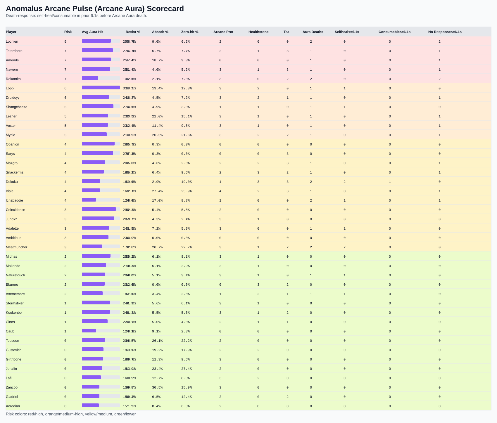

# Arcane Pulse (Arcane Aura) Player Scorecard

This scorecard focuses on Arcane Aura intake, mitigation proxies, consumable usage, and death-response behavior.

**Death-response rule requested:** if a player died to Arcane Aura, check for self-heal or consumable within the previous **6.1 seconds**.

## Included Graphic

## Columns

- `avg_aura_hit`: average Arcane Aura damage taken per hit
- `resist%`: resisted portion proxy from log resisted values
- `absorb%`: absorbed portion proxy from log absorbed values
- `arcane_prot`, `healthstone`, `tea`: casts observed during fight windows
- `aura_deaths`: deaths where last meaningful incoming damage was Arcane Aura
- `selfheal<=6.1s`: count of Arcane Aura deaths with a self-heal in prior 6.1s
- `consumable<=6.1s`: count of Arcane Aura deaths with Arcane Protection/Healthstone/Tea in prior 6.1s
- `no_response<=6.1s`: Arcane Aura deaths with neither self-heal nor listed consumable in prior 6.1s

| player | risk | avg_aura_hit | resist% | absorb% | zero_hit% | arcane_prot | healthstone | tea | aura_deaths | selfheal<=6.1s | consumable<=6.1s | no_response<=6.1s |
|---|---:|---:|---:|---:|---:|---:|---:|---:|---:|---:|---:|---:|
| Lochien | 9 | 255.7 | 44.4% | 9.0% | 6.2% | 2 | 0 | 0 | 2 | 0 | 0 | 2 |
| Totemhero | 7 | 275.7 | 56.4% | 6.7% | 7.7% | 2 | 1 | 3 | 1 | 0 | 0 | 1 |
| Amends | 7 | 255.4 | 57.0% | 18.7% | 9.0% | 0 | 0 | 0 | 1 | 0 | 0 | 1 |
| Nawern | 7 | 250.4 | 61.0% | 4.0% | 5.2% | 3 | 1 | 3 | 1 | 0 | 0 | 1 |
| Rokomito | 7 | 145.6 | 52.8% | 2.1% | 7.3% | 3 | 0 | 2 | 2 | 0 | 0 | 2 |
| Lopp | 6 | 335.1 | 50.1% | 13.4% | 12.3% | 3 | 2 | 0 | 1 | 1 | 0 | 0 |
| Druidcyy | 6 | 241.3 | 58.7% | 4.5% | 7.2% | 3 | 2 | 1 | 1 | 0 | 0 | 1 |
| Shangcheeze | 5 | 279.5 | 54.8% | 4.9% | 3.8% | 1 | 1 | 0 | 1 | 1 | 0 | 0 |
| Lezner | 5 | 232.5 | 60.3% | 22.0% | 15.1% | 3 | 1 | 0 | 1 | 0 | 0 | 1 |
| Voster | 5 | 231.4 | 62.8% | 11.4% | 9.6% | 3 | 1 | 0 | 1 | 0 | 0 | 1 |
| Mynie | 5 | 219.9 | 63.1% | 20.5% | 21.6% | 3 | 2 | 2 | 1 | 0 | 0 | 1 |
| Obanion | 4 | 290.7 | 55.3% | 0.3% | 0.0% | 0 | 0 | 0 | 0 | 0 | 0 | 0 |
| Sarys | 4 | 276.2 | 57.6% | 0.3% | 0.0% | 0 | 0 | 3 | 0 | 0 | 0 | 0 |
| Mazgro | 4 | 208.0 | 65.3% | 4.6% | 2.6% | 2 | 2 | 3 | 1 | 0 | 0 | 1 |
| Snackermz | 4 | 195.2 | 65.0% | 6.4% | 9.6% | 2 | 3 | 2 | 1 | 0 | 0 | 1 |
| Dokuku | 4 | 161.0 | 59.8% | 2.9% | 19.0% | 1 | 3 | 3 | 2 | 2 | 1 | 0 |
| Iriale | 4 | 160.7 | 72.8% | 27.4% | 25.9% | 4 | 2 | 3 | 1 | 0 | 0 | 1 |
| Ichabaddie | 4 | 124.6 | 68.6% | 17.0% | 8.8% | 1 | 0 | 0 | 2 | 1 | 0 | 1 |
| Coincidence | 3 | 299.2 | 52.9% | 5.4% | 5.5% | 2 | 0 | 0 | 0 | 0 | 0 | 0 |
| Junoxz | 3 | 287.7 | 59.2% | 4.3% | 2.4% | 3 | 1 | 0 | 0 | 0 | 0 | 0 |
| Adalette | 3 | 243.5 | 61.5% | 7.2% | 5.9% | 3 | 0 | 0 | 1 | 1 | 0 | 0 |
| Ambitious | 3 | 236.9 | 63.7% | 0.0% | 0.0% | 0 | 0 | 0 | 0 | 0 | 0 | 0 |
| Meatmuncher | 3 | 178.8 | 62.7% | 20.7% | 22.7% | 3 | 1 | 2 | 2 | 2 | 0 | 0 |
| Midnas | 2 | 253.2 | 60.2% | 6.1% | 8.1% | 3 | 1 | 0 | 0 | 0 | 0 | 0 |
| Makende | 2 | 214.2 | 49.9% | 5.1% | 2.9% | 2 | 1 | 0 | 0 | 0 | 0 | 0 |
| Naturetouch | 2 | 204.0 | 68.2% | 5.1% | 3.4% | 3 | 1 | 0 | 1 | 1 | 0 | 0 |
| Ekureru | 2 | 201.6 | 62.8% | 0.0% | 0.0% | 0 | 3 | 2 | 0 | 0 | 0 | 0 |
| Axememore | 2 | 183.6 | 67.6% | 3.4% | 2.6% | 1 | 2 | 1 | 1 | 1 | 0 | 0 |
| Stormstiker | 1 | 248.5 | 61.0% | 5.6% | 6.1% | 3 | 1 | 0 | 0 | 0 | 0 | 0 |
| Koukenbol | 1 | 248.3 | 61.1% | 5.5% | 5.6% | 3 | 1 | 2 | 0 | 0 | 0 | 0 |
| Cinos | 1 | 229.1 | 60.3% | 5.0% | 4.6% | 2 | 1 | 1 | 0 | 0 | 0 | 0 |
| Caub | 1 | 124.1 | 70.8% | 9.1% | 2.8% | 0 | 0 | 0 | 0 | 0 | 0 | 0 |
| Topsoon | 0 | 204.5 | 64.7% | 26.1% | 22.2% | 2 | 0 | 0 | 0 | 0 | 0 | 0 |
| Gustovich | 0 | 191.5 | 59.6% | 19.2% | 17.9% | 2 | 2 | 0 | 0 | 0 | 0 | 0 |
| Girthbone | 0 | 190.7 | 69.6% | 11.3% | 9.6% | 3 | 0 | 0 | 0 | 0 | 0 | 0 |
| Jorailin | 0 | 181.9 | 63.1% | 23.4% | 27.4% | 2 | 0 | 0 | 0 | 0 | 0 | 0 |
| Lafi | 0 | 169.9 | 63.7% | 12.7% | 8.8% | 3 | 2 | 0 | 0 | 0 | 0 | 0 |
| Zancoo | 0 | 156.8 | 69.7% | 30.5% | 15.9% | 3 | 0 | 0 | 0 | 0 | 0 | 0 |
| Gladriel | 0 | 156.3 | 59.2% | 6.5% | 12.4% | 2 | 0 | 2 | 0 | 0 | 0 | 0 |
| Aerodian | 0 | 151.9 | 71.1% | 8.4% | 6.5% | 2 | 0 | 0 | 0 | 0 | 0 | 0 |
