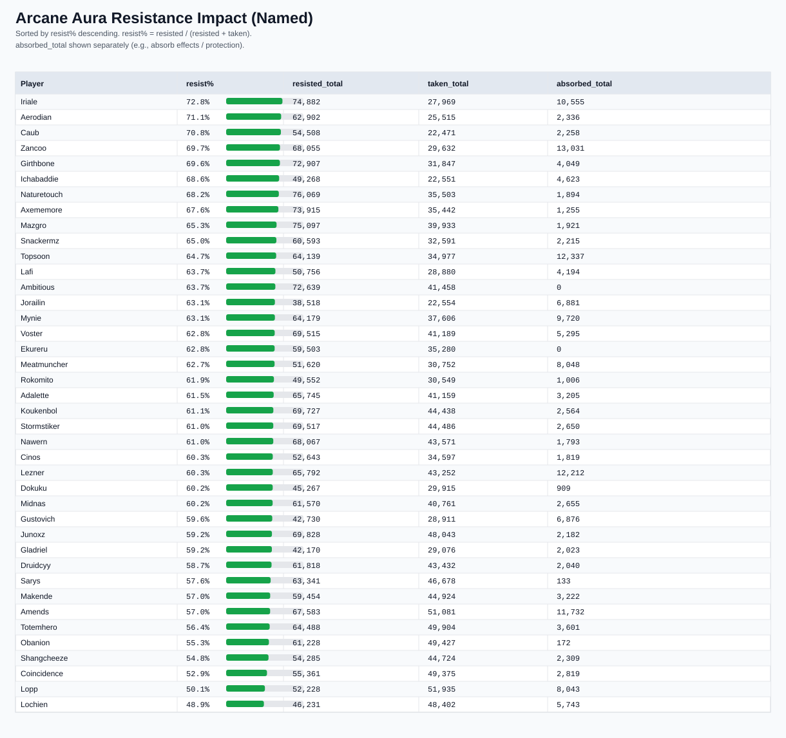

# Arcane Pulse / Arcane Aura Resistance Scorecard (Named)

- Sorted by **resist% descending** (most resisted -> least resisted).
- `resist% = resisted / (resisted + taken)`
- `absorbed_total` shown separately.

| player | resist% | resisted_total | taken_total | absorbed_total |
|---|---:|---:|---:|---:|
| Iriale | 72.8% | 74882 | 27969 | 10555 |
| Aerodian | 71.1% | 62902 | 25515 | 2336 |
| Caub | 70.8% | 54508 | 22471 | 2258 |
| Zancoo | 69.7% | 68055 | 29632 | 13031 |
| Girthbone | 69.6% | 72907 | 31847 | 4049 |
| Ichabaddie | 68.6% | 49268 | 22551 | 4623 |
| Naturetouch | 68.2% | 76069 | 35503 | 1894 |
| Axememore | 67.6% | 73915 | 35442 | 1255 |
| Mazgro | 65.3% | 75097 | 39933 | 1921 |
| Snackermz | 65.0% | 60593 | 32591 | 2215 |
| Topsoon | 64.7% | 64139 | 34977 | 12337 |
| Lafi | 63.7% | 50756 | 28880 | 4194 |
| Ambitious | 63.7% | 72639 | 41458 | 0 |
| Jorailin | 63.1% | 38518 | 22554 | 6881 |
| Mynie | 63.1% | 64179 | 37606 | 9720 |
| Voster | 62.8% | 69515 | 41189 | 5295 |
| Ekureru | 62.8% | 59503 | 35280 | 0 |
| Meatmuncher | 62.7% | 51620 | 30752 | 8048 |
| Rokomito | 61.9% | 49552 | 30549 | 1006 |
| Adalette | 61.5% | 65745 | 41159 | 3205 |
| Koukenbol | 61.1% | 69727 | 44438 | 2564 |
| Stormstiker | 61.0% | 69517 | 44486 | 2650 |
| Nawern | 61.0% | 68067 | 43571 | 1793 |
| Cinos | 60.3% | 52643 | 34597 | 1819 |
| Lezner | 60.3% | 65792 | 43252 | 12212 |
| Dokuku | 60.2% | 45267 | 29915 | 909 |
| Midnas | 60.2% | 61570 | 40761 | 2655 |
| Gustovich | 59.6% | 42730 | 28911 | 6876 |
| Junoxz | 59.2% | 69828 | 48043 | 2182 |
| Gladriel | 59.2% | 42170 | 29076 | 2023 |
| Druidcyy | 58.7% | 61818 | 43432 | 2040 |
| Sarys | 57.6% | 63341 | 46678 | 133 |
| Makende | 57.0% | 59454 | 44924 | 3222 |
| Amends | 57.0% | 67583 | 51081 | 11732 |
| Totemhero | 56.4% | 64488 | 49904 | 3601 |
| Obanion | 55.3% | 61228 | 49427 | 172 |
| Shangcheeze | 54.8% | 54285 | 44724 | 2309 |
| Coincidence | 52.9% | 55361 | 49375 | 2819 |
| Lopp | 50.1% | 52228 | 51935 | 8043 |
| Lochien | 48.9% | 46231 | 48402 | 5743 |
