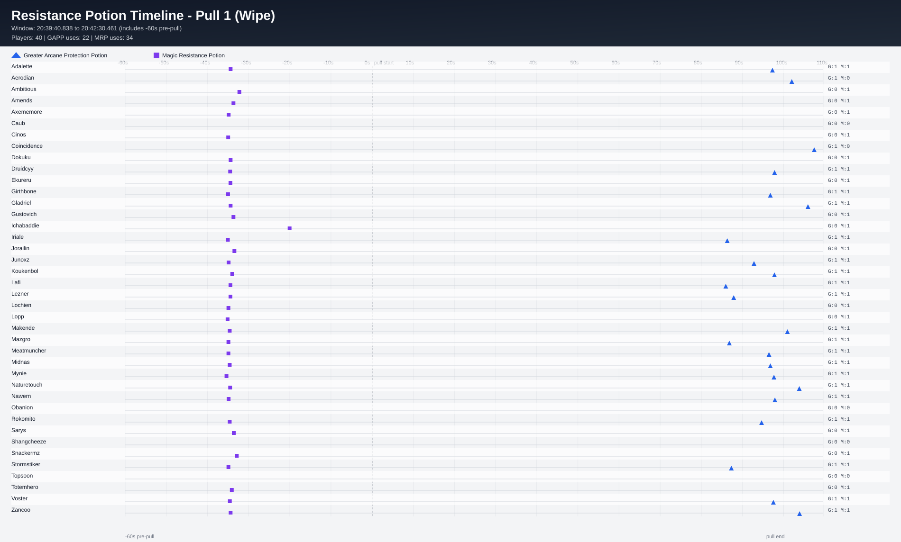
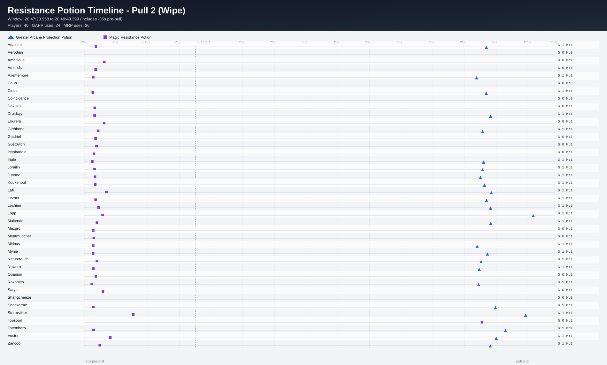
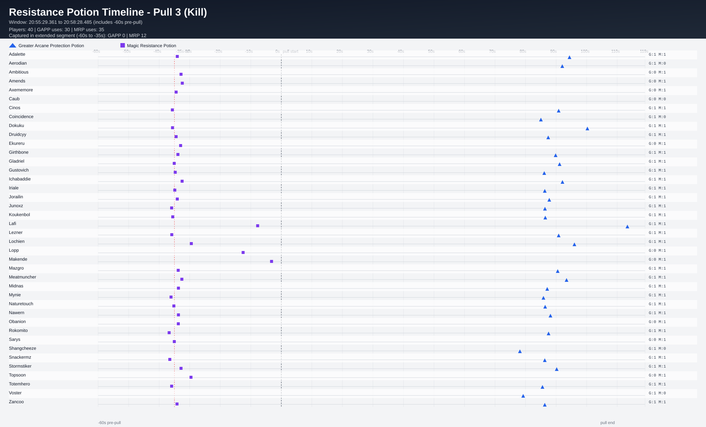

# Resistance Potion Usage Timelines (Per Pull + 35s Prepull Window)

Tracked consumables:
- **Magic Resistance Potion** (MRP)
- **Greater Arcane Protection Potion** (GAPP)

Each pull chart includes events from **-35s pre-pull** through pull end, so prepot MRP usage is captured.

Legend:
- **Blue triangle** = GAPP
- **Purple square** = MRP

## Pull 1 (Wipe)

- Timeline window: **20:40:07.095 -> 20:42:30.461**
- Relative window: **-00:35.00 -> 01:48.37**
- Players shown: **40**
- GAPP uses in window: **22** | MRP uses in window: **0**

| player | gapp_uses | mrp_uses | first_gapp_rel_to_pull | first_mrp_rel_to_pull |
|---|---:|---:|---:|---:|
| Adalette | 1 | 0 | 01:36.02 | - |
| Aerodian | 1 | 0 | 01:40.73 | - |
| Ambitious | 0 | 0 | - | - |
| Amends | 0 | 0 | - | - |
| Axememore | 0 | 0 | - | - |
| Caub | 0 | 0 | - | - |
| Cinos | 0 | 0 | - | - |
| Coincidence | 1 | 0 | 01:46.18 | - |
| Dokuku | 0 | 0 | - | - |
| Druidcyy | 1 | 0 | 01:36.54 | - |
| Ekureru | 0 | 0 | - | - |
| Girthbone | 1 | 0 | 01:35.51 | - |
| Gladriel | 1 | 0 | 01:44.66 | - |
| Gustovich | 0 | 0 | - | - |
| Ichabaddie | 0 | 0 | - | - |
| Iriale | 1 | 0 | 01:25.04 | - |
| Jorailin | 0 | 0 | - | - |
| Junoxz | 1 | 0 | 01:31.55 | - |
| Koukenbol | 1 | 0 | 01:36.50 | - |
| Lafi | 1 | 0 | 01:24.68 | - |
| Lezner | 1 | 0 | 01:25.91 | - |
| Lochien | 0 | 0 | - | - |
| Lopp | 0 | 0 | - | - |
| Makende | 1 | 0 | 01:39.67 | - |
| Mazgro | 1 | 0 | 01:25.55 | - |
| Meatmuncher | 1 | 0 | 01:35.18 | - |
| Midnas | 1 | 0 | 01:35.51 | - |
| Mynie | 1 | 0 | 01:36.40 | - |
| Naturetouch | 1 | 0 | 01:42.55 | - |
| Nawern | 1 | 0 | 01:36.63 | - |
| Obanion | 0 | 0 | - | - |
| Rokomito | 1 | 0 | 01:33.38 | - |
| Sarys | 0 | 0 | - | - |
| Shangcheeze | 0 | 0 | - | - |
| Snackermz | 0 | 0 | - | - |
| Stormstiker | 1 | 0 | 01:26.04 | - |
| Topsoon | 0 | 0 | - | - |
| Totemhero | 0 | 0 | - | - |
| Voster | 1 | 0 | 01:36.26 | - |
| Zancoo | 1 | 0 | 01:42.62 | - |

## Pull 2 (Wipe)

- Timeline window: **20:47:22.859 -> 20:49:49.399**
- Relative window: **-00:35.00 -> 01:51.54**
- Players shown: **40**
- GAPP uses in window: **24** | MRP uses in window: **36**

| player | gapp_uses | mrp_uses | first_gapp_rel_to_pull | first_mrp_rel_to_pull |
|---|---:|---:|---:|---:|
| Adalette | 1 | 1 | 01:30.00 | -00:33.25 |
| Aerodian | 0 | 0 | - | - |
| Ambitious | 0 | 1 | - | -00:30.60 |
| Amends | 0 | 1 | - | -00:33.32 |
| Axememore | 1 | 1 | 01:26.91 | -00:34.10 |
| Caub | 0 | 0 | - | - |
| Cinos | 1 | 1 | 01:29.96 | -00:34.21 |
| Coincidence | 0 | 0 | - | - |
| Dokuku | 0 | 1 | - | -00:33.61 |
| Druidcyy | 1 | 1 | 01:31.32 | -00:33.66 |
| Ekureru | 0 | 1 | - | -00:30.64 |
| Girthbone | 1 | 1 | 01:28.21 | -00:32.54 |
| Gladriel | 0 | 1 | - | -00:33.81 |
| Gustovich | 0 | 1 | - | -00:33.06 |
| Ichabaddie | 0 | 1 | - | -00:33.88 |
| Iriale | 1 | 1 | 01:29.12 | -00:34.40 |
| Jorailin | 1 | 1 | 01:28.77 | -00:33.66 |
| Junoxz | 1 | 1 | 01:28.11 | -00:33.54 |
| Koukenbol | 1 | 1 | 01:29.42 | -00:33.47 |
| Lafi | 1 | 1 | 01:31.55 | -00:29.94 |
| Lezner | 1 | 1 | 01:30.07 | -00:33.81 |
| Lochien | 1 | 1 | 01:31.32 | -00:32.39 |
| Lopp | 1 | 1 | 01:44.83 | -00:31.13 |
| Makende | 1 | 1 | 01:31.36 | -00:32.91 |
| Mazgro | 0 | 1 | - | -00:34.10 |
| Meatmuncher | 0 | 1 | - | -00:33.92 |
| Midnas | 1 | 1 | 01:27.06 | -00:34.10 |
| Mynie | 1 | 1 | 01:30.33 | -00:34.14 |
| Naturetouch | 1 | 1 | 01:28.16 | -00:33.77 |
| Nawern | 1 | 1 | 01:27.75 | -00:34.07 |
| Obanion | 0 | 1 | - | -00:33.25 |
| Rokomito | 1 | 1 | 01:27.56 | -00:34.56 |
| Sarys | 0 | 1 | - | -00:31.02 |
| Shangcheeze | 0 | 0 | - | - |
| Snackermz | 1 | 1 | 01:32.21 | -00:34.07 |
| Stormstiker | 1 | 1 | 01:42.40 | -00:21.49 |
| Topsoon | 0 | 1 | - | 01:28.62 |
| Totemhero | 1 | 1 | 01:36.04 | -00:33.99 |
| Voster | 1 | 1 | 01:33.10 | -00:28.72 |
| Zancoo | 1 | 1 | 01:31.25 | -00:32.02 |

## Pull 3 (Kill)

- Timeline window: **20:55:54.361 -> 20:58:32.084**
- Relative window: **-00:35.00 -> 02:02.72**
- Players shown: **40**
- GAPP uses in window: **30** | MRP uses in window: **22**

| player | gapp_uses | mrp_uses | first_gapp_rel_to_pull | first_mrp_rel_to_pull |
|---|---:|---:|---:|---:|
| Adalette | 1 | 1 | 01:33.71 | -00:34.07 |
| Aerodian | 1 | 0 | 01:32.01 | - |
| Ambitious | 0 | 1 | - | -00:32.83 |
| Amends | 0 | 1 | - | -00:32.43 |
| Axememore | 0 | 1 | - | -00:34.45 |
| Caub | 0 | 0 | - | - |
| Cinos | 1 | 0 | 01:30.83 | - |
| Coincidence | 1 | 0 | 01:25.02 | - |
| Dokuku | 1 | 0 | 01:40.23 | - |
| Druidcyy | 1 | 1 | 01:27.42 | -00:34.45 |
| Ekureru | 0 | 1 | - | -00:32.98 |
| Girthbone | 1 | 1 | 01:29.66 | -00:33.87 |
| Gladriel | 1 | 0 | 01:31.13 | - |
| Gustovich | 1 | 0 | 01:26.11 | - |
| Ichabaddie | 1 | 1 | 01:32.07 | -00:33.27 |
| Iriale | 1 | 1 | 01:26.27 | -00:34.88 |
| Jorailin | 1 | 1 | 01:27.75 | -00:34.07 |
| Junoxz | 1 | 0 | 01:26.34 | - |
| Koukenbol | 1 | 0 | 01:26.45 | - |
| Lafi | 1 | 1 | 01:53.35 | -00:07.74 |
| Lezner | 1 | 0 | 01:30.83 | - |
| Lochien | 1 | 1 | 01:35.99 | -00:29.47 |
| Lopp | 0 | 1 | - | -00:13.28 |
| Makende | 0 | 1 | - | -00:03.20 |
| Mazgro | 1 | 1 | 01:30.52 | -00:33.76 |
| Meatmuncher | 1 | 1 | 01:33.41 | -00:32.57 |
| Midnas | 1 | 1 | 01:27.08 | -00:33.69 |
| Mynie | 1 | 0 | 01:25.66 | - |
| Naturetouch | 1 | 0 | 01:25.71 | - |
| Nawern | 1 | 1 | 01:28.14 | -00:33.69 |
| Obanion | 0 | 1 | - | -00:33.73 |
| Rokomito | 1 | 0 | 01:27.52 | - |
| Sarys | 0 | 0 | - | - |
| Shangcheeze | 1 | 0 | 01:17.69 | - |
| Snackermz | 1 | 0 | 01:26.27 | - |
| Stormstiker | 1 | 1 | 01:30.19 | -00:32.83 |
| Topsoon | 0 | 1 | - | -00:29.58 |
| Totemhero | 1 | 0 | 01:25.53 | - |
| Voster | 1 | 0 | 01:19.21 | - |
| Zancoo | 1 | 1 | 01:26.27 | -00:34.15 |

