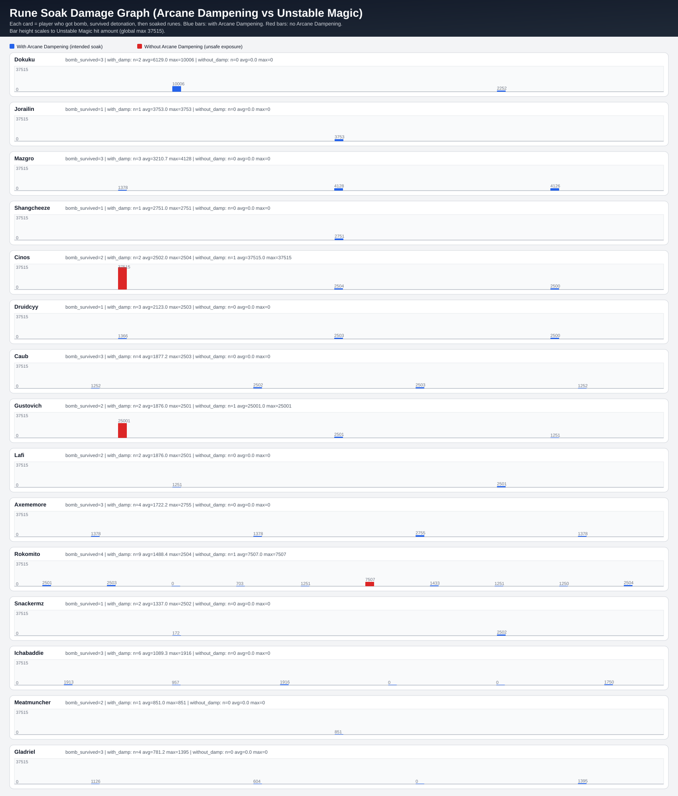

# Arcane Rune Soak Analysis

## What this report answers

This report isolates rune-soak behavior and asks two practical questions:

1. How much damage did players take while soaking runes with the correct bomb debuff?
2. Who took rune damage without that debuff (unsafe soak), and did those events kill them?

## Mechanic mapping from the combat log

- `Arcane Dampening` = the post-bomb debuff that enables intended rune soaking.
- `Unstable Magic` from `Unstable Magic Zone` = rune/ground-zone damage event used here as soak damage.

## Included graph

Legend:
- Blue bar = `Unstable Magic` hit while player had `Arcane Dampening` (intended soak).
- Red bar = `Unstable Magic` hit without `Arcane Dampening` (unsafe exposure).
- Light blue shaded lane = time window where `Arcane Dampening` was active for that player.
- `D+` = dampening applied, `D-` = dampening faded.
- `☠` marker above a bar = that specific hit was followed by player death within 0.35s.

## Executive summary

- Bomb casts detected: **51**
- Bomb carriers who survived detonation: **39** events across **18** players
- Players meeting your requested graph scope (bombed + survived + soaked): **15**
- Unsafe no-debuff rune hits (all players): **9**
- Unsafe no-debuff rune hits that were lethal (<=0.35s): **9/9**
- Dampened soak hits that were lethal (<=0.35s): **3/46**

## Per-player summary (requested scope: bombed, survived, then soaked)

| player | bomb_survived | damp_soaks | damp_avg | damp_max | damp_deaths | no_debuff_hits | no_debuff_avg | no_debuff_max | no_debuff_deaths |
|---|---:|---:|---:|---:|---:|---:|---:|---:|---:|
| Cinos | 2 | 2 | 2502.0 | 2504 | 1 | 1 | 37515.0 | 37515 | 1 |
| Gustovich | 2 | 2 | 1876.0 | 2501 | 0 | 1 | 25001.0 | 25001 | 1 |
| Rokomito | 4 | 9 | 1488.4 | 2504 | 0 | 1 | 7507.0 | 7507 | 1 |
| Dokuku | 3 | 2 | 6129.0 | 10006 | 1 | 0 | 0.0 | 0 | 0 |
| Jorailin | 1 | 1 | 3753.0 | 3753 | 0 | 0 | 0.0 | 0 | 0 |
| Mazgro | 3 | 3 | 3210.7 | 4128 | 0 | 0 | 0.0 | 0 | 0 |
| Shangcheeze | 1 | 1 | 2751.0 | 2751 | 0 | 0 | 0.0 | 0 | 0 |
| Druidcyy | 1 | 3 | 2123.0 | 2503 | 0 | 0 | 0.0 | 0 | 0 |
| Caub | 3 | 4 | 1877.2 | 2503 | 0 | 0 | 0.0 | 0 | 0 |
| Lafi | 2 | 2 | 1876.0 | 2501 | 0 | 0 | 0.0 | 0 | 0 |
| Axememore | 3 | 4 | 1722.2 | 2755 | 1 | 0 | 0.0 | 0 | 0 |
| Snackermz | 1 | 2 | 1337.0 | 2502 | 0 | 0 | 0.0 | 0 | 0 |
| Ichabaddie | 3 | 6 | 1089.3 | 1916 | 0 | 0 | 0.0 | 0 | 0 |
| Meatmuncher | 2 | 1 | 851.0 | 851 | 0 | 0 | 0.0 | 0 | 0 |
| Gladriel | 3 | 4 | 781.2 | 1395 | 0 | 0 | 0.0 | 0 | 0 |

## Flagged unsafe soak deaths (no debuff)

| player | in_graph_scope | no_debuff_hits | no_debuff_max | no_debuff_avg | lethal_no_debuff_hits |
|---|---:|---:|---:|---:|---:|
| Makende | no | 2 | 10018 | 10016.5 | 2 |
| Lochien | no | 2 | 10006 | 10003.0 | 2 |
| Cinos | yes | 1 | 37515 | 37515.0 | 1 |
| Gustovich | yes | 1 | 25001 | 25001.0 | 1 |
| Zancoo | no | 1 | 12504 | 12504.0 | 1 |
| Ekureru | no | 1 | 11260 | 11260.0 | 1 |
| Rokomito | yes | 1 | 7507 | 7507.0 | 1 |

## Notes on interpretation

- This is event-level attribution from timestamps; position vectors are not present in this log format.
- A red bar with a skull is a high-confidence unsafe rune exposure death signal.
- A blue bar without skull still represents real soak cost and should be minimized via raid movement/rotation.

