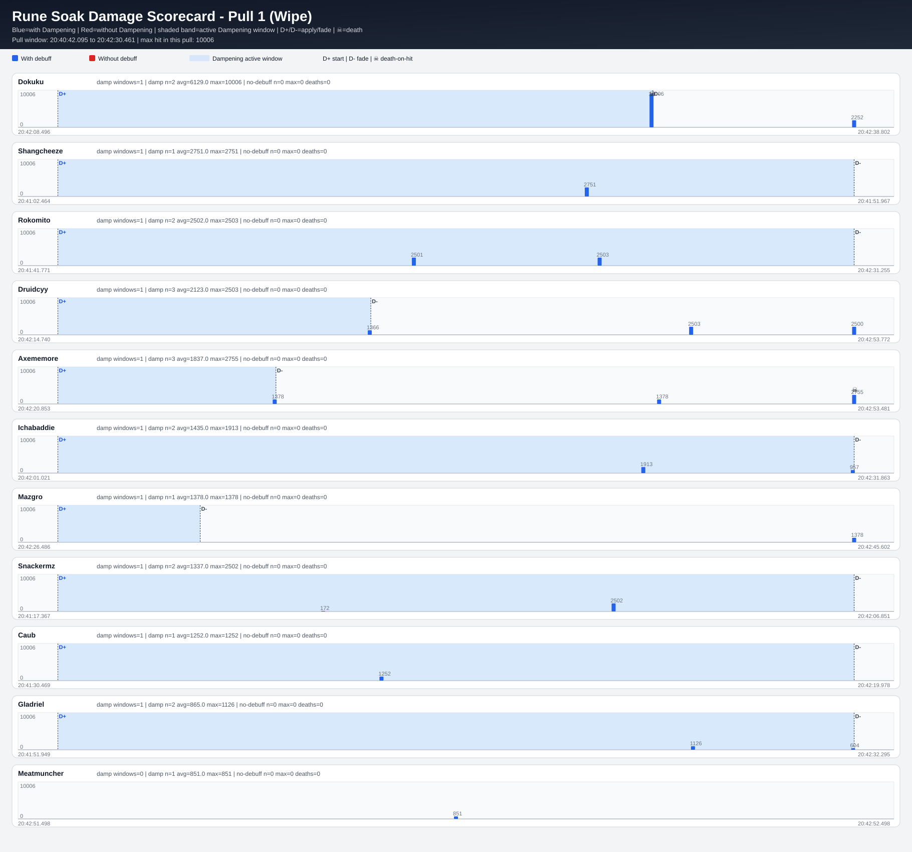
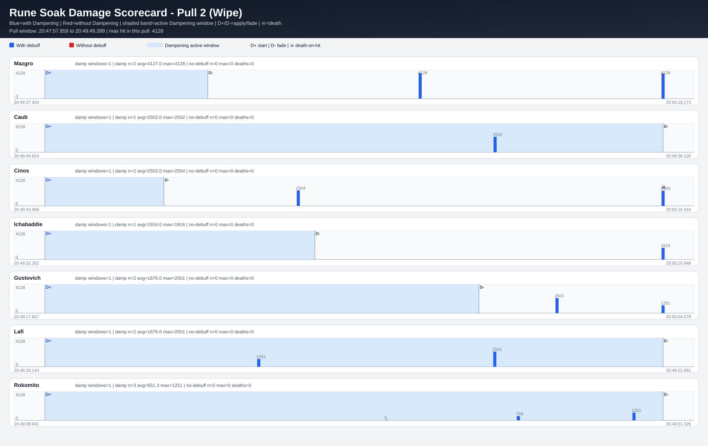
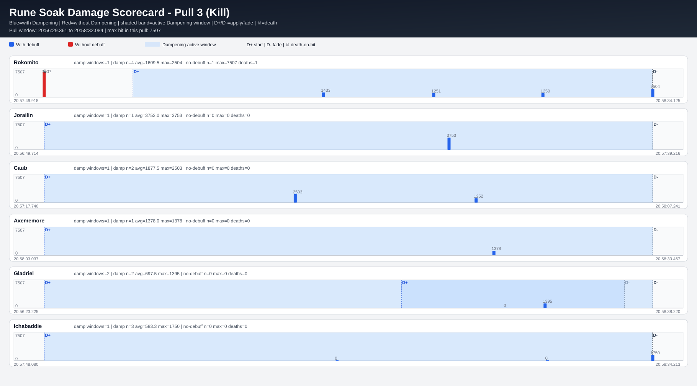

# Arcane Rune Soak Analysis (Per Pull)

## What this report answers

This report breaks rune soaking out **per fight attempt** (Pull 1 / Pull 2 / Pull 3) so you can see behavior in each attempt independently.

Mechanic mapping from the combat log:
- `Arcane Dampening` = post-bomb debuff used for intended rune soaking.
- `Unstable Magic` from `Unstable Magic Zone` = rune/ground-zone damage event.

Graph legend (all pull charts):
- Blue bar = `Unstable Magic` hit while player had `Arcane Dampening`
- Red bar = `Unstable Magic` hit while player did **not** have `Arcane Dampening`
- Shaded blue band = active `Arcane Dampening` window
- `D+` / `D-` = dampening applied / faded
- `☠` = player died within 0.35s of that hit

## Pull 1 (Wipe)

- Pull window: **20:40:42.095 -> 20:42:30.461**
- Bomb casts: **16** | Bomb-survived events: **11**
- Players in requested graph scope (bombed + survived + soaked): **11**
- No-debuff rune hits: **4** | lethal: **4/4**
- Dampened rune hits: **20** | lethal: **2/20**

### Per-player summary (this pull)

| player | bomb_survived | damp_soaks | damp_avg | damp_max | damp_deaths | no_debuff_hits | no_debuff_avg | no_debuff_max | no_debuff_deaths |
|---|---:|---:|---:|---:|---:|---:|---:|---:|---:|
| Dokuku | 1 | 2 | 6129.0 | 10006 | 1 | 0 | 0.0 | 0 | 0 |
| Shangcheeze | 1 | 1 | 2751.0 | 2751 | 0 | 0 | 0.0 | 0 | 0 |
| Rokomito | 1 | 2 | 2502.0 | 2503 | 0 | 0 | 0.0 | 0 | 0 |
| Druidcyy | 1 | 3 | 2123.0 | 2503 | 0 | 0 | 0.0 | 0 | 0 |
| Axememore | 1 | 3 | 1837.0 | 2755 | 1 | 0 | 0.0 | 0 | 0 |
| Ichabaddie | 1 | 2 | 1435.0 | 1913 | 0 | 0 | 0.0 | 0 | 0 |
| Mazgro | 1 | 1 | 1378.0 | 1378 | 0 | 0 | 0.0 | 0 | 0 |
| Snackermz | 1 | 2 | 1337.0 | 2502 | 0 | 0 | 0.0 | 0 | 0 |
| Caub | 1 | 1 | 1252.0 | 1252 | 0 | 0 | 0.0 | 0 | 0 |
| Gladriel | 1 | 2 | 865.0 | 1126 | 0 | 0 | 0.0 | 0 | 0 |
| Meatmuncher | 1 | 1 | 851.0 | 851 | 0 | 0 | 0.0 | 0 | 0 |

### Unsafe soak deaths (no debuff, this pull)

| player | in_graph_scope | no_debuff_hits | no_debuff_avg | no_debuff_max | lethal_no_debuff_hits |
|---|---:|---:|---:|---:|---:|
| Cinos | no | 1 | 37515.0 | 37515 | 1 |
| Gustovich | no | 1 | 25001.0 | 25001 | 1 |
| Zancoo | no | 1 | 12504.0 | 12504 | 1 |
| Ekureru | no | 1 | 11260.0 | 11260 | 1 |

---

## Pull 2 (Wipe)

- Pull window: **20:47:57.859 -> 20:49:49.399**
- Bomb casts: **20** | Bomb-survived events: **14**
- Players in requested graph scope (bombed + survived + soaked): **7**
- No-debuff rune hits: **2** | lethal: **2/2**
- Dampened rune hits: **13** | lethal: **1/13**

### Per-player summary (this pull)

| player | bomb_survived | damp_soaks | damp_avg | damp_max | damp_deaths | no_debuff_hits | no_debuff_avg | no_debuff_max | no_debuff_deaths |
|---|---:|---:|---:|---:|---:|---:|---:|---:|---:|
| Mazgro | 1 | 2 | 4127.0 | 4128 | 0 | 0 | 0.0 | 0 | 0 |
| Caub | 1 | 1 | 2502.0 | 2502 | 0 | 0 | 0.0 | 0 | 0 |
| Cinos | 1 | 2 | 2502.0 | 2504 | 1 | 0 | 0.0 | 0 | 0 |
| Ichabaddie | 1 | 1 | 1916.0 | 1916 | 0 | 0 | 0.0 | 0 | 0 |
| Gustovich | 1 | 2 | 1876.0 | 2501 | 0 | 0 | 0.0 | 0 | 0 |
| Lafi | 1 | 2 | 1876.0 | 2501 | 0 | 0 | 0.0 | 0 | 0 |
| Rokomito | 2 | 3 | 651.3 | 1251 | 0 | 0 | 0.0 | 0 | 0 |

### Unsafe soak deaths (no debuff, this pull)

| player | in_graph_scope | no_debuff_hits | no_debuff_avg | no_debuff_max | lethal_no_debuff_hits |
|---|---:|---:|---:|---:|---:|
| Makende | no | 1 | 10018.0 | 10018 | 1 |
| Lochien | no | 1 | 10000.0 | 10000 | 1 |

---

## Pull 3 (Kill)

- Pull window: **20:56:29.361 -> 20:58:32.084**
- Bomb casts: **15** | Bomb-survived events: **14**
- Players in requested graph scope (bombed + survived + soaked): **6**
- No-debuff rune hits: **3** | lethal: **3/3**
- Dampened rune hits: **13** | lethal: **0/13**

### Per-player summary (this pull)

| player | bomb_survived | damp_soaks | damp_avg | damp_max | damp_deaths | no_debuff_hits | no_debuff_avg | no_debuff_max | no_debuff_deaths |
|---|---:|---:|---:|---:|---:|---:|---:|---:|---:|
| Rokomito | 1 | 4 | 1609.5 | 2504 | 0 | 1 | 7507.0 | 7507 | 1 |
| Jorailin | 1 | 1 | 3753.0 | 3753 | 0 | 0 | 0.0 | 0 | 0 |
| Caub | 1 | 2 | 1877.5 | 2503 | 0 | 0 | 0.0 | 0 | 0 |
| Axememore | 1 | 1 | 1378.0 | 1378 | 0 | 0 | 0.0 | 0 | 0 |
| Gladriel | 1 | 2 | 697.5 | 1395 | 0 | 0 | 0.0 | 0 | 0 |
| Ichabaddie | 1 | 3 | 583.3 | 1750 | 0 | 0 | 0.0 | 0 | 0 |

### Unsafe soak deaths (no debuff, this pull)

| player | in_graph_scope | no_debuff_hits | no_debuff_avg | no_debuff_max | lethal_no_debuff_hits |
|---|---:|---:|---:|---:|---:|
| Makende | no | 1 | 10015.0 | 10015 | 1 |
| Lochien | no | 1 | 10006.0 | 10006 | 1 |
| Rokomito | yes | 1 | 7507.0 | 7507 | 1 |

---

