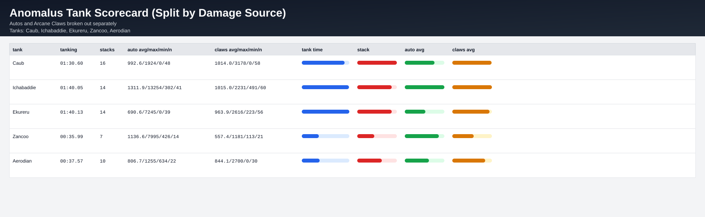

# Anomalus Tank Scorecard (Autos vs Arcane Claws)

Tanks analyzed: **Caub, Ichabaddie, Ekureru, Zancoo, Aerodian**

Metric notes:
- `Length spent tanking` uses contiguous windows of direct boss tank hits (autos + Arcane Claws) with a max 8s gap.
- `Max stacks` uses highest observed `Manabound Strikes` stack value.
- Damage values are split by source into boss **auto attacks** and **Arcane Claws**.

## Overall Tank Scorecard

| tank | length_tanking | max_manabound_stacks | auto_avg | auto_max | auto_min | auto_hits | claws_avg | claws_max | claws_min | claws_hits |
|---|---:|---:|---:|---:|---:|---:|---:|---:|---:|---:|
| Caub | 01:30.60 | 16 | 992.6 | 1924 | 0 | 48 | 1014.0 | 3178 | 0 | 58 |
| Ichabaddie | 01:40.05 | 14 | 1311.9 | 13254 | 302 | 41 | 1015.0 | 2231 | 491 | 60 |
| Ekureru | 01:40.13 | 14 | 690.6 | 7245 | 0 | 39 | 963.9 | 2616 | 223 | 56 |
| Zancoo | 00:35.99 | 7 | 1136.6 | 7995 | 426 | 14 | 557.4 | 1181 | 113 | 21 |
| Aerodian | 00:37.57 | 10 | 806.7 | 1255 | 634 | 22 | 844.1 | 2700 | 0 | 30 |

## Pull 1 (Wipe)

| tank | length_tanking | max_manabound_stacks | auto_avg | auto_max | auto_min | auto_hits | claws_avg | claws_max | claws_min | claws_hits |
|---|---:|---:|---:|---:|---:|---:|---:|---:|---:|---:|
| Caub | 00:32.13 | 14 | 1116.4 | 1924 | 832 | 16 | 887.4 | 2062 | 0 | 21 |
| Ichabaddie | 00:26.54 | 14 | 1269.7 | 8590 | 566 | 15 | 777.2 | 1381 | 558 | 15 |
| Ekureru | 00:25.85 | 12 | 472.7 | 735 | 0 | 12 | 827.4 | 1477 | 453 | 16 |
| Zancoo | 00:15.60 | 5 | 711.6 | 901 | 584 | 5 | 582.6 | 781 | 438 | 9 |
| Aerodian | 00:18.16 | 9 | 817.0 | 1255 | 634 | 9 | 871.2 | 2700 | 0 | 13 |

## Pull 2 (Wipe)

| tank | length_tanking | max_manabound_stacks | auto_avg | auto_max | auto_min | auto_hits | claws_avg | claws_max | claws_min | claws_hits |
|---|---:|---:|---:|---:|---:|---:|---:|---:|---:|---:|
| Caub | 00:29.15 | 16 | 954.2 | 1609 | 777 | 16 | 1229.1 | 3178 | 598 | 17 |
| Ichabaddie | 00:44.49 | 12 | 1824.4 | 13254 | 629 | 13 | 1200.8 | 2231 | 513 | 26 |
| Ekureru | 00:48.41 | 14 | 994.2 | 7245 | 265 | 15 | 1029.9 | 2447 | 394 | 24 |
| Zancoo | 00:06.15 | 0 | 7995.0 | 7995 | 7995 | 1 | 450.5 | 788 | 113 | 2 |
| Aerodian | 00:02.31 | 2 | 777.3 | 845 | 642 | 3 | 1040.5 | 1181 | 619 | 4 |

## Pull 3 (Kill)

| tank | length_tanking | max_manabound_stacks | auto_avg | auto_max | auto_min | auto_hits | claws_avg | claws_max | claws_min | claws_hits |
|---|---:|---:|---:|---:|---:|---:|---:|---:|---:|---:|
| Caub | 00:29.31 | 16 | 907.1 | 1422 | 0 | 16 | 964.0 | 2031 | 577 | 20 |
| Ichabaddie | 00:29.02 | 13 | 848.0 | 1572 | 302 | 13 | 948.6 | 1753 | 491 | 19 |
| Ekureru | 00:25.87 | 12 | 529.1 | 855 | 0 | 12 | 1001.5 | 2616 | 223 | 16 |
| Zancoo | 00:14.24 | 7 | 545.0 | 777 | 426 | 8 | 556.1 | 1181 | 406 | 10 |
| Aerodian | 00:17.09 | 10 | 806.3 | 1014 | 727 | 10 | 756.5 | 1715 | 0 | 13 |

