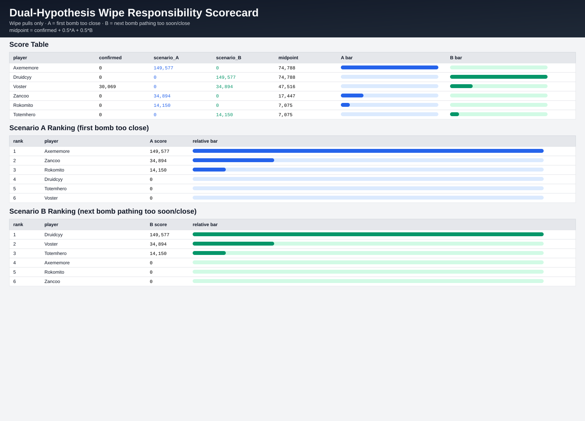

# Anomalus Wipe Responsibility Report (Dual-Hypothesis)

This report isolates **wipe-pull Arcane Bomb chains** and explicitly models the two valid interpretations for full-timer cascades:

- **Scenario A (first-bomb distance failure):** first full-timer detonator did not reach safe distance.
- **Scenario B (next-bomb pathing failure):** next bomb carrier ran/path'd too soon or too close, got clipped, then detonated early mid-run.

Because logs do not expose exact movement vectors/positions, both scenarios remain plausible for full-timer starts.

## Included Scorecard Graphic

---

## Wipe-Pull Cluster Breakdown (Both Possibilities Shown)

### Pull 1

1. **Double:** Ekureru -> Stormstiker (**115,992** cluster raid damage)  
   - First det: Ekureru at 4.407s (early)  
   - Classified cause: **external Unstable Magic spike** (not clean bomb execution blame)  
   - Follow-up: Stormstiker at 8.895s (cascade)

2. **Double:** Voster -> Makende (**30,069** cluster raid damage)  
   - First det: Voster at 1.137s (very early)  
   - Classified cause: **death-trigger pattern** (confirmed root-cause event)  
   - Follow-up: Makende at 5.590s (cascade)

### Pull 2

1. **Triple:** Axememore -> Druidcyy -> Lopp (**149,577**)  
   - First det: Axememore at 15.023s (full timer)  
   - **Scenario A:** Axememore detonated too close to raid pathing lanes.  
   - **Scenario B:** Druidcyy path'd too soon/too close, got clipped, then early-det'd at 10.513s (Lopp then cascaded at 5.940s).

2. **Double:** Zancoo -> Voster (**34,894**)  
   - First det: Zancoo at 15.020s (full timer)  
   - **Scenario A:** Zancoo's detonation location was too close.  
   - **Scenario B:** Voster path'd into overlap and early-det'd at 5.960s.

3. **Triple:** Rokomito -> Totemhero -> Stormstiker (**14,150**)  
   - First det: Rokomito at 15.029s (full timer)  
   - **Scenario A:** Rokomito's full-timer placement started the chain.  
   - **Scenario B:** Totemhero (1.582s) was clipped while moving and detonated almost immediately, then Stormstiker cascaded.

---

## Explicit Scorecard Method (What the scores mean)

Scoring units are weighted by **wipe-cluster raid damage**.

Raw components:
- `confirmed_root`: direct, non-ambiguous root-cause assignment.
- `scenario_A`: assign ambiguous full-timer starts to first detonator.
- `scenario_B`: assign ambiguous full-timer starts to next carrier who early-det'd.

Lens scores:
- `A_raw = confirmed_root + scenario_A`  (positioning accountability lens)
- `B_raw = confirmed_root + scenario_B`  (pathing/timing accountability lens)
- `balanced_raw = confirmed_root + 0.5*scenario_A + 0.5*scenario_B`

Normalized indices (for easy comparison):
- `A_index = 100 * A_raw / max(A_raw)`
- `B_index = 100 * B_raw / max(B_raw)`
- `balanced_index = 100 * balanced_raw / max(balanced_raw)`

Notes:
- The Ekureru -> Stormstiker wipe cluster is labeled external (`Unstable Magic`) and is **excluded** from this player-blame scorecard.
- A high A score does **not** prove B is false (and vice versa); it shows priority under that coaching lens.

## Dual-Hypothesis Blame Scorecard (Ranked by `balanced_index`)

| rank | player | confirmed_root | scenario_A | scenario_B | A_raw | B_raw | balanced_raw | A_index | B_index | balanced_index | interpretation |
|---:|---|---:|---:|---:|---:|---:|---:|---:|---:|---:|---|
| 1 | Axememore | 0 | 149577 | 0 | 149577 | 0 | 74789 | 100.0 | 0.0 | 100.0 | Dominant under Scenario A (first-bomb distance/placement) |
| 2 | Druidcyy | 0 | 0 | 149577 | 0 | 149577 | 74789 | 0.0 | 100.0 | 100.0 | Dominant under Scenario B (next-bomb path/timing overlap) |
| 3 | Voster | 30069 | 0 | 34894 | 30069 | 64963 | 47516 | 20.1 | 43.4 | 63.5 | Confirmed root once + additional Scenario B-sensitive role |
| 4 | Zancoo | 0 | 34894 | 0 | 34894 | 0 | 17447 | 23.3 | 0.0 | 23.3 | Scenario A-sensitive responsibility in one large chain |
| 5 | Rokomito | 0 | 14150 | 0 | 14150 | 0 | 7075 | 9.5 | 0.0 | 9.5 | Lower-volume Scenario A-sensitive role |
| 6 | Totemhero | 0 | 0 | 14150 | 0 | 14150 | 7075 | 0.0 | 9.5 | 9.5 | Lower-volume Scenario B-sensitive role |

---

## Practical Accountability Guidance

Use this as a two-lens accountability model:

1. **Position lens (Scenario A):** hold first full-timer carriers accountable for corner selection and distance.
2. **Pathing lens (Scenario B):** hold next-bomb carriers accountable for delayed departure, lane selection, and avoiding overlap with an active full-timer det lane.

For coaching/review, treat both as active failure modes and validate with POV/raid positioning calls where possible.
